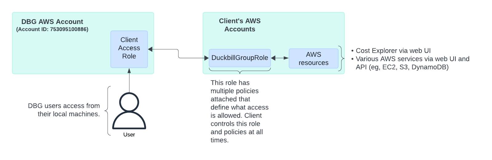

# AWS CLI Role Creation

This repo contains tooling to create AWS IAM roles and policies that Duckbill Group will use to access your AWS accounts. We use [role assumption](https://docs.aws.amazon.com/STS/latest/APIReference/API_AssumeRole.html) rather than dedicated IAM users, and the scripts and templates here will enable you to create those resources in your AWS account.

Our IAM role should ideally be set up in every AWS account you have. If that’s not feasible, then please apply it to your master payer account and your largest (by spend) accounts. (Exception: the `SkywayRole` role only needs to be set up in your payer account.)

More details about how we access client accounts, and the details of our internal operations with such, can be found in [our writeup about overhauling AWS access in 2023](https://www.duckbillgroup.com/blog/overhauling-aws-account-access-with-terraform-granted-and-gitops/).

## Prerequisites

You'll need the [AWS CLI](https://aws.amazon.com/cli/) installed and [configured](https://docs.aws.amazon.com/cli/latest/userguide/cli-chap-configure.html) for your target AWS account. Your AWS user will need to have privileges to create IAM roles and policies in your target account.

## Creating Resources

From this directory, create the IAM role and policies via our role creation script:

    $ make create

The script will prompt you for a couple of required parameters:

*Customer Name Slug:* This is a short, lower-case slug that identifies your company, e.g. `acme-corp`. Duckbill Group provided this to you in the Client Onboarding Guide.

*External ID:* The External ID used when Duckbill assumes the role. Duckbill Group provided this to you in the Client Onboarding Guide.

## Deleting Resources

After we've completed our engagement, you can delete our IAM role and policy resources from your AWS account:

    $ make delete

If you prefer or need to use the AWS console, you can delete the resources manually.

### Deleting Resources Manually

Log into the AWS console,

 - navigate to `IAM > Policies` and delete: `DuckbillGroupBilling`, `SkywayAccess`, `DuckbillGroupResourceDiscovery`, `DuckbillGroupDenySensitiveAccess`
 - navigate to `IAM > Roles` and delete `DuckbillGroupRole` and `SkywayRole`

## What this code does

* Creates two roles titled `DuckbillGroupRole` and `SkywayRole`
* Creates custom policies: `DuckbillGroupBilling`, `DuckbillGroupResourceDiscovery`, `DuckbillGroupDenySensitiveAccess`, `SkywayAccess`
* Attaches the policies prefixed with `DuckbillGroup` to the `DuckbillGroupRole` role, along with the AWS-managed policy `ViewOnlyAccess`
* Attaches the policy `SkywayAccess` to the `SkywayRole` role

### Policy: DuckbillGroupBilling and SkywayAccess

This policies defines access related to AWS billing actions. Everything is read-only.

### Policy: DuckbillGroupResourceDiscovery

This policy is an extension of the AWS-managed policy `ViewOnlyAccess` and defines more view-only actions that weren't included in the AWS-managed policy.

### Policy: DuckbillGroupDenySensitiveAccess

This policy adds explicit denials for certain actions that are read-only but may be considered sensitive, such as `s3:GetObject`. This is a [fork of the work done by Chris Farris](https://www.chrisfarris.com/post/sensitive_iam_actions/) to enumerate sensitive read-only actions in AWS.

## Developer Information

We lint our shell scripts with `shellcheck` and JSON with `python -m json.tool`, which runs in CI on every PR. If you have `shellcheck` and `python` installed locally, you can run the linter:

    $ make lint
